# Vcard

## [DEMO : Vcard ](https://vcard.myvcard.xyz/)

Vcard 是一個參考 Dcard 製作的社群交友平台，可以在這個平台發文討論，並且結交卡友，主要功能如下：

* **看板文章系統** - 文章建立、編輯、刪除、按讚、收藏、留言功能。
* **會員管理系統** - Google login、文章管理、收藏管理、訂閱通知管理。
* **抽卡配對系統** - 定時卡片配對，鼓勵用戶之間的連接。
* **即時聊天系統** - 透過 socket.io 為配對的用戶提供即時聊天。

## 技術說明

### 後端

* 框架：`Node.js Express`
* `RabbitMQ`： 消息隊列管理發布/訂閱通知。
* `Google OAuth 2.0` & `JWT`： 安全的第三方登入和用戶資訊儲存。
* `Socket.IO`： 實現即時通訊。
* `Cron` 作業： 每天午夜定時執行卡片配對。
* `RESTful API` & `MVC` 架構： 保持代碼可維護性和可擴展性。
* `Jest` & `Supertest`： 單元測試和整合測試。

### 資料庫

* `MongoDB` 資料庫：透過 NoSQL 高效資料檢索和可擴展儲存。
* `Redis`： 實現文章的預載快取，以減少資料庫負擔。

### AWS

* `S3`
* `CloudFront`

### 部署

* `SSL` 證書 ( Let's Encrypt )： 確保安全的 HTTPS 連接。
* `Nginx`： 反向代理和靜態網站部署。
* `GitHub Actions`： CI/CD 一鍵自動部署至 AWS EC2。
* `Docker` & `Docker-Compose`： 所有服務的容器編排。

### 前端

* 框架：`React`
* 狀態管理：`Zustand`
* 樣式管理：`Tailwind css`
* `Markdown` 支持： 使用 markdown 語法進行內容編輯，以實現豐富的文本格式。
* `Blob url` 實時預覽：文章透過 Blob 圖片即時預覽，並透過 localStorage 實現自動儲存。
* `RWD`：響應式網頁設計。

## 系統架構圖

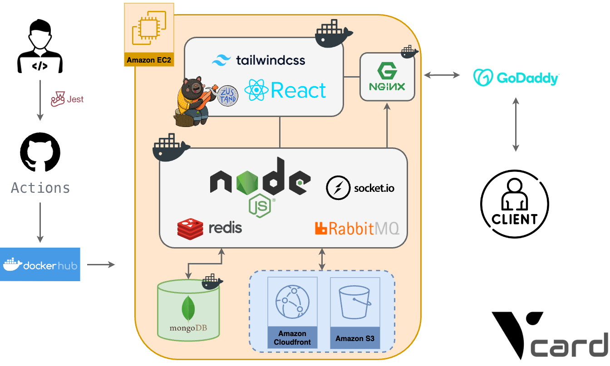

## 資料庫架構圖

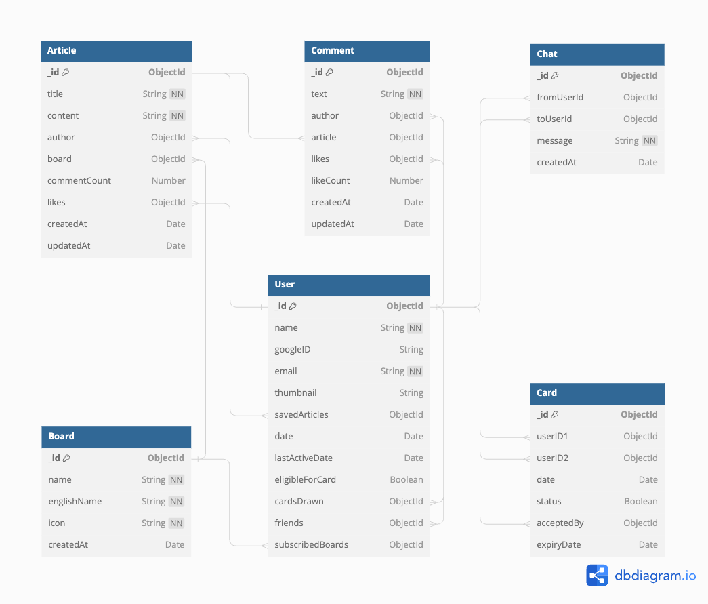

## 功能介紹

### **看板文章系統**

未登入時，可以瀏覽文章，但不能按讚、留言跟收藏文章，實現權限控管

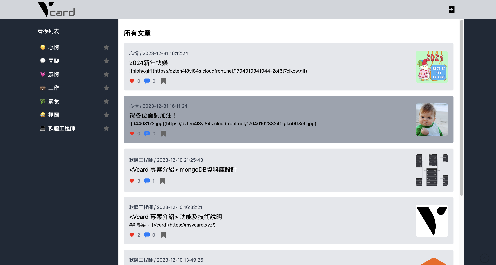

登入後首頁會標示用戶訂閱的看板、收藏的文章

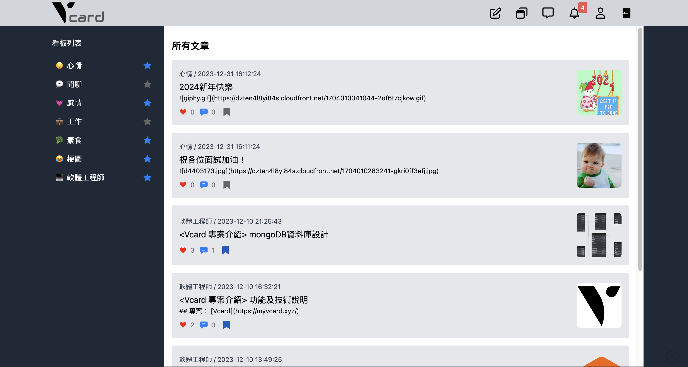

文章編輯器整合 Markdown 語法與 Blob Url 圖片即時預覽，並透過 LocalStorage 實現文章編輯的本地自動儲存

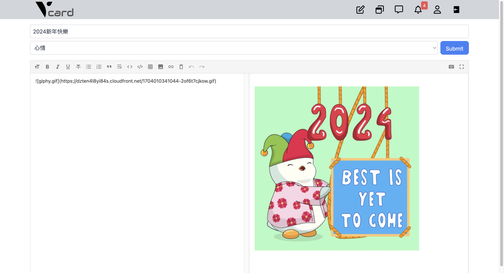

若訂閱的看板有發布文章，則會透過 RabbitMQ 消息對列及 Socket.IO 即時傳送通知給使用者

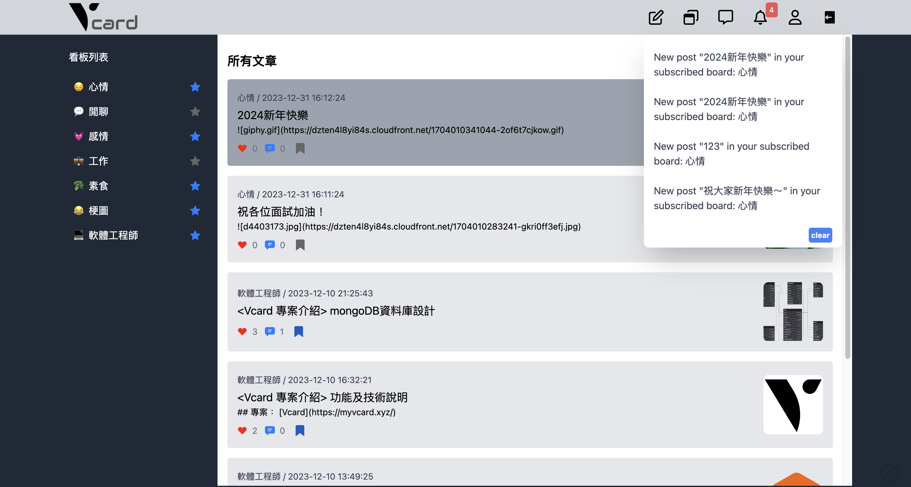

文章可以按愛心及收藏，並可以在底下留言，或是對其他留言按愛心

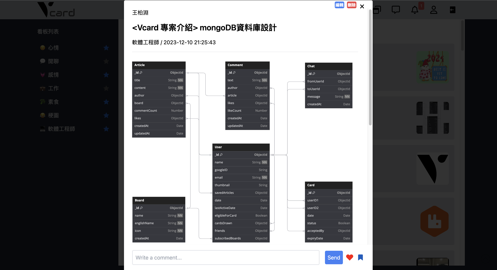

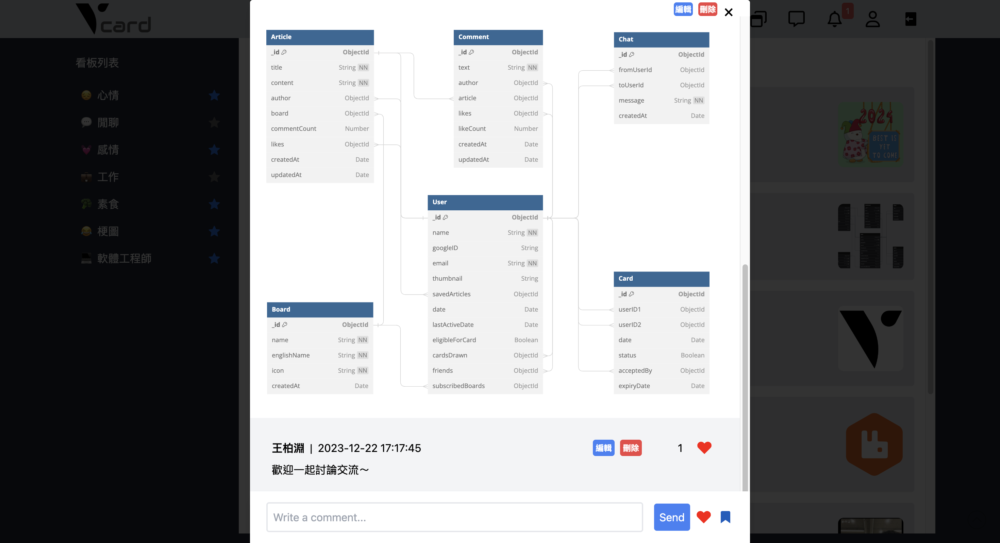

### **會員管理系統**

透過第三方 Google login 登入，

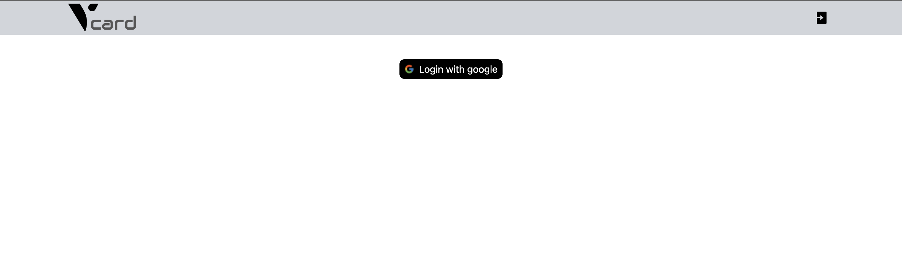

會員頁面顯示個人資料、所發佈的文章及收藏的文章

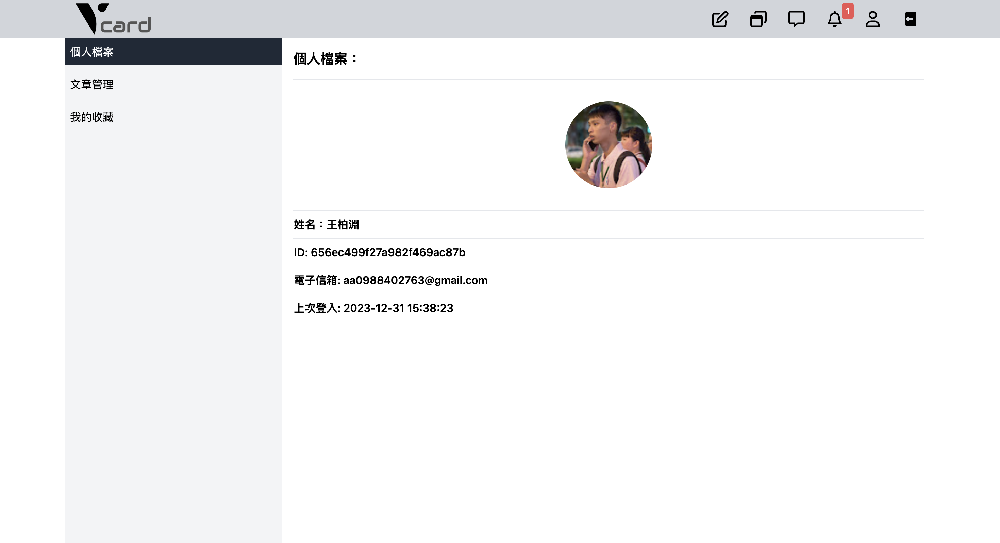

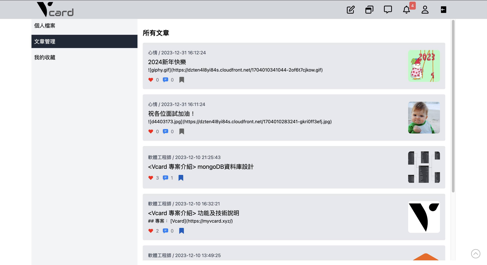

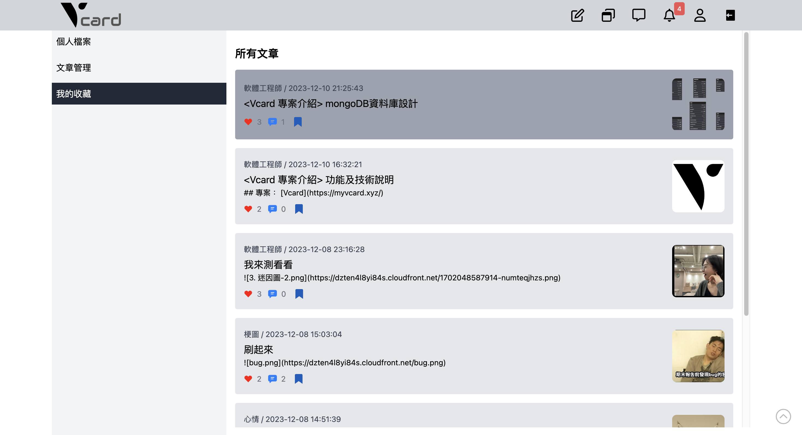

### **抽卡配對系統**

#### **配對機制（含流程圖）**

1. 參考 dcard 抽卡配對機制，透過 `node-cron` 於每日凌晨 11:59 進行用戶自動化配對
2. **資格檢查：**
   首先評估用戶是否有資格參與抽卡。系統會檢查用戶的最後登入日期，並更新其抽卡資格狀態。如果用戶在過去3天內登入，則將其標記為有資格參與。
3. **用戶配對：**
   系統將列出所有有資格的用戶並進行配對。配對過程會避免重複配對或者將用戶配對給他們先前已經抽過的對象。每一對成功配對的用戶將生成一個新的卡片實例，並設定一個24小時後的到期時間。
4. **接受配對：**
   用戶可以選擇接受或忽略配對。當雙方用戶均接受配對時，他們將互相加入好友名單，進而可以開始互動。
5. **清除過期配對：**
   最後，系統將定期檢查並標記過期的配對為無效，以保持數據的整潔和正確性。

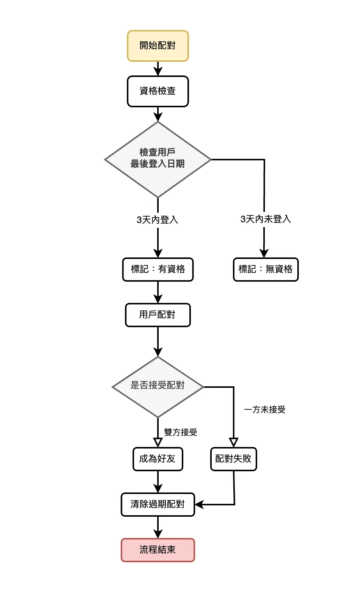

登入後，點選抽卡按鈕，會顯示自動配對到的卡友

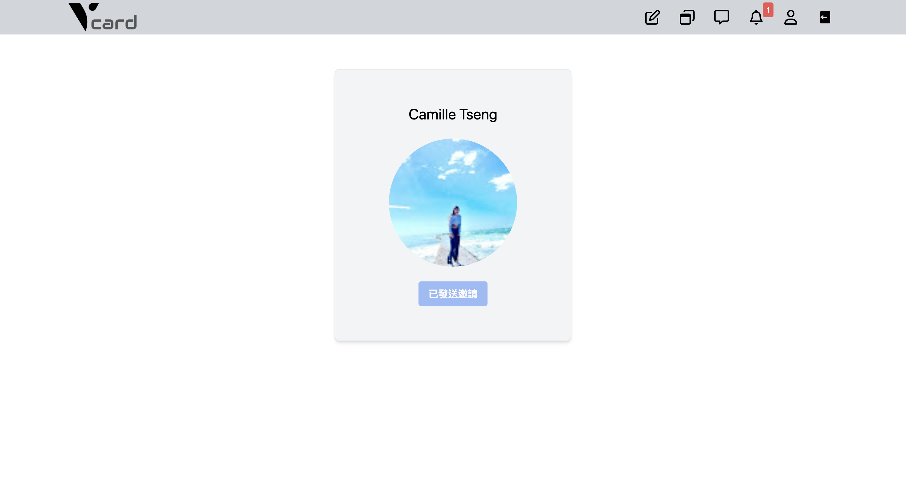

### **即時聊天系統**

透過 Socket.IO 為配對成功的用戶提供即時聊天功能

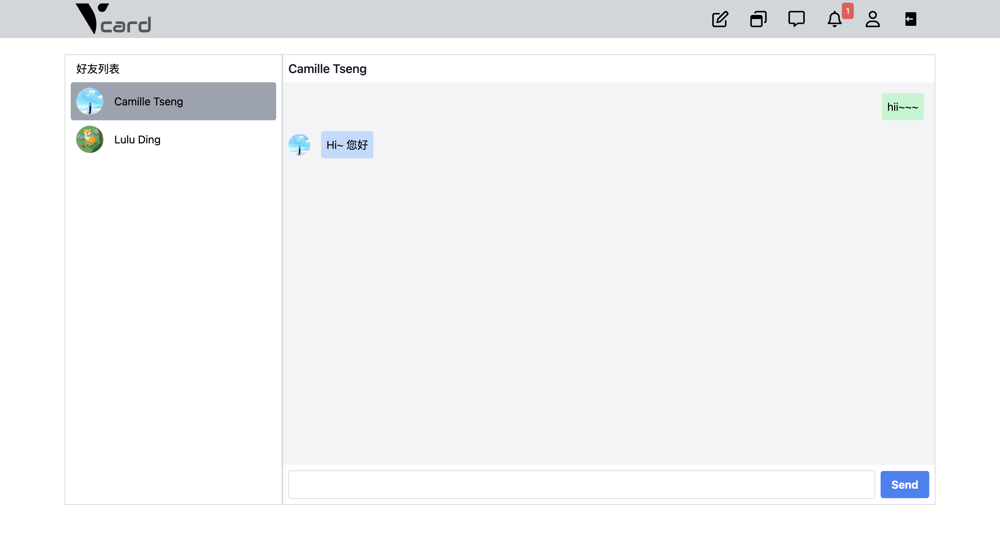
